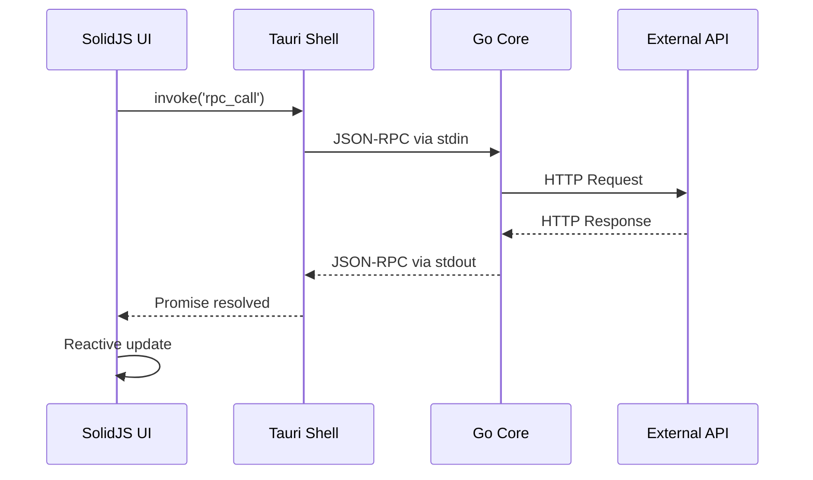

## System Overview

Eru is built with a modern three-layer architecture designed for performance, maintainability, and cross-platform compatibility. Each layer communicates through well-defined interfaces using JSON-RPC 2.0 protocol.

```
┌─────────────────────────────────────────────────────────────┐
│                        SolidJS UI                           │
│              Reactive UI layer (TypeScript)                 │
└─────────────────────────┬───────────────────────────────────┘
                          │ IPC
┌─────────────────────────┴───────────────────────────────────┐
│                       Tauri Shell                           │
│            Desktop wrapper (Rust) - spawns sidecar          │
└─────────────────────────┬───────────────────────────────────┘
                          │ Sidecar
┌─────────────────────────┴───────────────────────────────────┐
│                        Go Core                              │
│     HTTP execution • Plugin runtime • Persistence           │
└─────────────────────────────────────────────────────────────┘
```

## Layer 1: SolidJS UI

The frontend is built with **SolidJS**, a reactive JavaScript framework optimized for performance.

### Technology Stack

- **SolidJS 1.8+** - Fine-grained reactive UI framework
- **TypeScript** - Type-safe development
- **Vite** - Fast build tooling and HMR
- **TanStack Virtual** - Virtual scrolling for large datasets
- **PostHog** - Anonymous analytics (opt-out available)

### UI Structure

```
apps/desktop/ui/src/
├── App.tsx              # Main application component
├── index.tsx            # Entry point
├── components/          # Reusable UI components
│   ├── AppStyles.tsx    # Shared styling components
│   ├── JSONEditor.tsx   # Request body editor
│   ├── JSONViewer.tsx   # Response viewer
│   ├── ResponseCompare.tsx  # Diff comparison UI
│   └── WorkflowEditor.tsx   # Workflow chain builder
├── stores/              # Reactive state management
├── lib/                 # Utilities and helpers
└── theme.css            # Global styles
```

### Communication with Tauri

The UI communicates with the Tauri shell using the `@tauri-apps/api` package:

```typescript
import { invoke } from '@tauri-apps/api/core';

// Call the Go core via Tauri's IPC
const result = await invoke('rpc_call', {
  method: 'request.execute',
  params: requestData
});
```

<Info>
The UI never communicates directly with the Go core. All communication flows through the Tauri shell for security and process isolation.
</Info>

## Layer 2: Tauri Shell

The **Tauri shell** is a Rust-based desktop wrapper that provides native OS integration and manages the Go sidecar process.

### Responsibilities

<CardGroup cols={2}>
  <Card title="Process Management" icon="server">
    Spawns and manages the Go core binary as a sidecar process
  </Card>
  <Card title="IPC Bridge" icon="bridge">
    Forwards JSON-RPC messages between UI and Go core
  </Card>
  <Card title="Native APIs" icon="window">
    Provides file dialogs, shell access, and OS integration
  </Card>
  <Card title="Event System" icon="bell">
    Converts Go notifications to Tauri events for real-time updates
  </Card>
</CardGroup>

### Tauri Configuration

The Tauri app is configured in `apps/desktop/src-tauri/tauri.conf.json`:

```json
{
  "productName": "Eru",
  "identifier": "com.api-client.app",
  "bundle": {
    "externalBin": ["binaries/apicore"]
  }
}
```

### Sidecar Manager

The `sidecar.rs` module handles Go process lifecycle:

<Steps>
  <Step title="Binary Discovery">
    Locates the `apicore` binary using platform-specific paths
    ```rust
    // Production: next to executable
    /Applications/Eru.app/Contents/MacOS/apicore
    
    // Development: in binaries directory
    src-tauri/binaries/apicore-aarch64-apple-darwin
    ```
  </Step>
  
  <Step title="Process Spawn">
    Spawns the Go binary with stdin/stdout/stderr pipes
    ```rust
    Command::new(&binary_path)
        .stdin(Stdio::piped())
        .stdout(Stdio::piped())
        .stderr(Stdio::piped())
        .spawn()
    ```
  </Step>
  
  <Step title="Communication Loop">
    - **Writer task**: Sends JSON-RPC requests to Go's stdin
    - **Reader task**: Parses responses from stdout
    - **Stderr task**: Logs Go core messages
  </Step>
</Steps>

### RPC Command Handler

The main Tauri command forwards all RPC calls to the sidecar:

```rust
#[tauri::command]
async fn rpc_call(
    method: String,
    params: serde_json::Value,
    state: tauri::State<'_, Arc<RwLock<SidecarManager>>>,
) -> Result<serde_json::Value, String> {
    let manager = state.read().await;
    manager.call(&method, params).await
}
```

<Note>
The Tauri shell uses a 60-second timeout for RPC calls. Long-running requests should use streaming or background jobs.
</Note>

## Layer 3: Go Core

The **Go core** is the engine powering Eru's API execution, plugin system, and data persistence.

### Core Modules

```
apps/desktop/core/
├── cmd/apicore/         # Main entry point
│   └── main.go          # JSON-RPC server initialization
├── internal/
│   ├── engine/          # HTTP request execution
│   ├── plugins/         # Plugin manager and runtime
│   ├── storage/         # File-based persistence
│   ├── streaming/       # WebSocket & SSE clients
│   ├── gitsync/         # Git-based collection sync
│   ├── importer/        # Postman/Insomnia import
│   ├── exporter/        # Collection export
│   ├── diff/            # Response comparison engine
│   ├── loadtest/        # Load testing runner
│   └── sync/            # Cloud sync (auth provider)
└── pkg/
    ├── ipc/             # JSON-RPC 2.0 protocol
    └── types/           # Shared type definitions
```

### JSON-RPC Server

The Go core implements a JSON-RPC 2.0 server over stdin/stdout for communication with Tauri:

```go
// Create RPC server reading from stdin, writing to stdout
server := ipc.NewServer(os.Stdin, os.Stdout)

// Register method handlers
server.Register("request.execute", func(params json.RawMessage) (interface{}, error) {
    var req types.Request
    json.Unmarshal(params, &req)
    return app.engine.Execute(&req)
})

// Start serving
server.Serve()
```

<Accordion title="Available RPC Methods">
  <AccordionItem title="Request Operations">
    - `request.execute` - Execute HTTP request
    - `request.cancel` - Cancel running request
    - `request.save` - Save request to collection
    - `request.list` - List all requests
    - `request.get` - Get request by ID
    - `request.delete` - Delete request
  </AccordionItem>
  
  <AccordionItem title="Collection Management">
    - `collection.list` - List all collections
    - `collection.get` - Get collection by ID
    - `collection.save` - Save collection
    - `collection.delete` - Delete collection
  </AccordionItem>
  
  <AccordionItem title="Environment Variables">
    - `environment.list` - List environments
    - `environment.get` - Get environment by ID
    - `environment.save` - Save environment
    - `environment.delete` - Delete environment
  </AccordionItem>
  
  <AccordionItem title="Real-time Protocols">
    - `sse.connect` - Connect to SSE endpoint
    - `sse.disconnect` - Close SSE connection
    - `ws.connect` - Connect WebSocket
    - `ws.send` - Send WebSocket message
    - `ws.disconnect` - Close WebSocket
  </AccordionItem>
  
  <AccordionItem title="Git Sync">
    - `gitsync.init` - Initialize Git repository
    - `gitsync.clone` - Clone remote repository
    - `gitsync.push` - Push changes
    - `gitsync.pull` - Pull updates
    - `gitsync.status` - Get sync status
  </AccordionItem>
  
  <AccordionItem title="Plugin System">
    - `plugin.list` - List loaded plugins
    - `plugin.load` - Load plugin from path
    - `plugin.unload` - Unload plugin
  </AccordionItem>
</Accordion>

### Request Engine

The `engine` package handles HTTP execution with plugin support:

```go
type Engine interface {
    Execute(req *types.Request) (*types.Response, error)
    Cancel(id string) error
}

// Execute runs HTTP request with plugin hooks
func (e *engine) Execute(req *Request) (*Response, error) {
    // Pre-request plugin hooks
    e.plugins.BeforeRequest(req)
    
    // Build and send HTTP request
    resp := e.sendHTTP(req)
    
    // Post-request plugin hooks
    e.plugins.AfterResponse(req, resp)
    
    return resp, nil
}
```

### Storage System

Data is persisted to `~/.api-client/data/` as JSON files:

```
~/.api-client/data/
├── collections/         # Collection metadata
│   └── {id}.json
├── requests/            # Request definitions
│   └── {id}.json
├── environments/        # Environment variables
│   └── {id}.json
└── responses/           # Saved responses for diffing
    └── {requestId}/
        └── {id}.json
```

<Warning>
The storage layer does not use a database. Collections are loaded entirely into memory for fast access. Large collections (>10,000 requests) may experience slowdowns.
</Warning>

## Communication Flow

Here's how a request execution flows through all three layers:

<Steps>
  <Step title="UI Action">
    User clicks "Send" button in SolidJS UI
    ```typescript
    const executeRequest = async () => {
      const result = await invoke('rpc_call', {
        method: 'request.execute',
        params: { url: 'https://api.example.com' }
      });
    };
    ```
  </Step>
  
  <Step title="Tauri IPC">
    Tauri invokes the `rpc_call` command handler in Rust
    ```rust
    // Routes to sidecar manager
    manager.call("request.execute", params).await
    ```
  </Step>
  
  <Step title="JSON-RPC Request">
    Rust writes JSON-RPC message to Go's stdin
    ```json
    {
      "jsonrpc": "2.0",
      "id": 1,
      "method": "request.execute",
      "params": { "url": "https://api.example.com" }
    }
    ```
  </Step>
  
  <Step title="Go Execution">
    Go core parses request and executes HTTP call
    ```go
    // Handler registered in main.go
    server.Register("request.execute", func(params json.RawMessage) {
        return app.engine.Execute(&req)
    })
    ```
  </Step>
  
  <Step title="JSON-RPC Response">
    Go writes response to stdout
    ```json
    {
      "jsonrpc": "2.0",
      "id": 1,
      "result": { "status": 200, "body": "..." }
    }
    ```
  </Step>
  
  <Step title="Rust Parse">
    Rust parses response and resolves the Promise
  </Step>
  
  <Step title="UI Update">
    SolidJS reactively updates the UI with results
  </Step>
</Steps>

## Event-Driven Updates

For real-time features like WebSocket and SSE, the Go core sends **notifications** (one-way messages without response):

```go
// Go core emits notification
server.Notify("sse.event", map[string]interface{}{
    "id": connectionId,
    "data": eventData,
})
```

Tauri converts these to events:

```rust
// Rust converts method name to event name
let event_name = notification.method.replace('.', "_");
handle.emit(&event_name, notification.params); // Emits "sse_event"
```

UI listens for events:

```typescript
import { listen } from '@tauri-apps/api/event';

listen('sse_event', (event) => {
  console.log('SSE message:', event.payload);
});
```

## Design Decisions

<CardGroup cols={2}>
  <Card title="Why Go for the core?" icon="golang">
    - Fast HTTP execution with minimal overhead
    - Excellent concurrency for parallel requests
    - Easy cross-compilation for all platforms
    - Rich ecosystem for HTTP, WebSocket, Git
  </Card>
  
  <Card title="Why Tauri over Electron?" icon="feather">
    - 10x smaller bundle size (~20MB vs ~200MB)
    - Lower memory footprint (uses system WebView)
    - Rust provides memory safety and performance
    - Native OS integration without bloat
  </Card>
  
  <Card title="Why SolidJS?" icon="bolt">
    - Fine-grained reactivity (no virtual DOM)
    - Fast rendering for large response bodies
    - Small bundle size (~7KB core)
    - TypeScript-first design
  </Card>
  
  <Card title="Why JSON-RPC?" icon="exchange">
    - Simple, language-agnostic protocol
    - Batch requests support
    - Standardized error handling
    - Easy to debug (plain JSON messages)
  </Card>
</CardGroup>

## Data Flow Diagram



## Performance Characteristics

<Tip>
**Typical latencies** (measured on M1 MacBook Pro):
- UI → Tauri IPC: **less than 1ms**
- Tauri → Go RPC: **less than 2ms**
- Go HTTP execution: **varies by API**
- Full round-trip overhead: **~3-5ms**
</Tip>

The architecture minimizes IPC overhead while maintaining clean separation of concerns. Most latency comes from network I/O, not internal communication.

## Next Steps

<CardGroup cols={2}>
  <Card title="Build from Source" icon="hammer" href="/development/building-from-source">
    Set up your development environment and build Eru
  </Card>
  <Card title="Contributing Guide" icon="users" href="/development/contributing">
    Learn how to contribute to the project
  </Card>
</CardGroup>