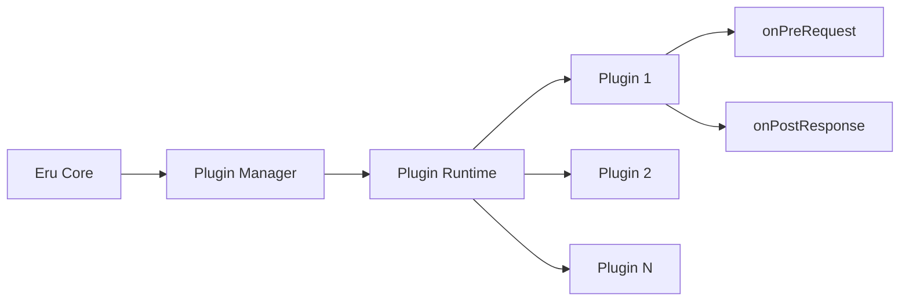

Eru's plugin system allows you to extend the API client with custom functionality. Plugins can modify requests, process responses, add authentication strategies, and transform data - all within a secure sandboxed environment.

## What Plugins Can Do

Plugins in Eru have access to powerful hooks that let you customize request/response behavior:

<CardGroup cols={2}>
  <Card title="Pre-Request Hooks" icon="arrow-right">
    Modify requests before execution: inject headers, transform bodies, add authentication, or abort requests based on custom logic.
  </Card>
  <Card title="Post-Response Hooks" icon="arrow-left">
    Process responses after execution: log data, transform response bodies, trigger notifications, or validate response structure.
  </Card>
  <Card title="Custom Authentication" icon="key">
    Implement custom auth strategies like OAuth flows, signature-based auth, or complex token refresh mechanisms.
  </Card>
  <Card title="Data Transformation" icon="shuffle">
    Transform request/response data formats, encrypt/decrypt payloads, or convert between different API schemas.
  </Card>
</CardGroup>

## Plugin Architecture

Plugins run in an isolated JavaScript runtime using [goja](https://github.com/dop251/goja), a pure Go JavaScript engine. This provides a secure sandbox that prevents plugins from accessing sensitive system resources without explicit permissions.



### Runtime Components

The plugin system consists of several key components:

<Steps>
  <Step title="Plugin Manager">
    Handles loading, unloading, enabling, and disabling plugins. Manages the lifecycle of all installed plugins.
  </Step>
  
  <Step title="Plugin Runtime">
    Executes plugin hooks using a sandboxed JavaScript VM. Each plugin runs in isolation with controlled access to system resources.
  </Step>
  
  <Step title="VM Pool">
    Maintains a pool of reusable JavaScript runtimes for efficient plugin execution without the overhead of creating new VMs.
  </Step>
  
  <Step title="Hook Executor">
    Orchestrates the execution of enabled plugins for each hook, managing the flow of context data between plugins.
  </Step>
</Steps>

## Plugin Lifecycle

Understanding the plugin lifecycle helps you build robust plugins that integrate seamlessly with Eru.

### 1. Loading

When a plugin is loaded:

<Steps>
  <Step title="File Reading">
    The plugin JavaScript file is read from disk.
  </Step>
  
  <Step title="Compilation">
    The JavaScript source is compiled into bytecode for faster execution.
  </Step>
  
  <Step title="Registration">
    The plugin is registered with the plugin manager and assigned a unique ID.
  </Step>
  
  <Step title="Enable State">
    By default, newly loaded plugins are enabled and ready to execute.
  </Step>
</Steps>

### 2. Execution

When a request is made:

```typescript
// Pre-Request Phase
for each enabled plugin {
  1. Get VM from pool
  2. Inject console API
  3. Run plugin script
  4. Execute onPreRequest hook
  5. Update request context
  6. Return VM to pool
}

// Execute HTTP Request

// Post-Response Phase
for each enabled plugin {
  1. Get VM from pool
  2. Inject console API
  3. Run plugin script
  4. Execute onPostResponse hook
  5. Update response context
  6. Return VM to pool
}
```

<Info>
  Plugins execute sequentially in the order they were loaded. Each plugin receives the context modified by previous plugins in the chain.
</Info>

### 3. State Management

Plugins can be in one of two states:

- **Enabled**: The plugin's hooks will execute during the request/response lifecycle
- **Disabled**: The plugin remains loaded but its hooks are skipped

```go
// Enable a plugin
manager.Enable("plugin-id")

// Disable a plugin
manager.Disable("plugin-id")
```

### 4. Unloading

When a plugin is unloaded:

1. The plugin is removed from the registry
2. All associated resources are freed
3. The plugin will no longer execute hooks

<Warning>
  Unloading a plugin does not persist storage data. Save important data before unloading.
</Warning>

## Security Model

Eru's plugin system is designed with security as a first-class concern. Plugins run in a restricted sandbox environment.

### Sandboxing

By default, plugins **cannot**:

<CardGroup cols={2}>
  <Card title="File System Access" icon="folder-xmark">
    Plugins cannot read from or write to the file system without explicit `file:read` permission.
  </Card>
  <Card title="Network Requests" icon="network-wired">
    Plugins cannot make external network calls without explicit `network` permission.
  </Card>
  <Card title="Process Spawning" icon="terminal">
    Plugins cannot spawn child processes or execute shell commands.
  </Card>
  <Card title="System APIs" icon="microchip">
    Plugins cannot access Node.js/Go native APIs or system-level functionality.
  </Card>
</CardGroup>

### Available APIs

Plugins have access to a limited set of safe APIs:

```javascript
// Console logging (automatically prefixed with plugin ID)
console.log("Info message");
console.error("Error message");

// Request/response manipulation through hooks
function onPreRequest(ctx) {
  // Access request, environment, storage, logging
  return { request: modifiedRequest };
}
```

## Permission System

Plugins must declare required permissions in their manifest. Users can review and approve permissions before installing a plugin.

### Available Permissions

<ParamField path="network" type="Permission">
  Allows the plugin to make external network requests. Required for plugins that need to call external APIs (e.g., OAuth providers, third-party services).
</ParamField>

<ParamField path="file:read" type="Permission">
  Allows the plugin to read files from the file system. Required for plugins that need to load configuration files or certificates.
</ParamField>

### Declaring Permissions

Permissions are declared in the plugin manifest:

```json
{
  "id": "my-plugin",
  "name": "My Plugin",
  "version": "1.0.0",
  "description": "A plugin that needs network access",
  "permissions": ["network"],
  "main": "index.js"
}
```

<Warning>
  Always request the minimum permissions required. Users are more likely to install plugins with fewer permission requirements.
</Warning>

## Plugin Structure

A minimal plugin consists of two files:

<CodeGroup>
```json manifest.json
{
  "id": "example-plugin",
  "name": "Example Plugin",
  "version": "1.0.0",
  "description": "An example plugin",
  "permissions": [],
  "main": "index.js"
}
```

```javascript index.js
function onPreRequest(ctx) {
  // Modify request before execution
  ctx.request.headers["X-Custom"] = "value";
  return { request: ctx.request };
}

function onPostResponse(ctx) {
  // Process response after execution
  console.log("Status:", ctx.response.statusCode);
  return { response: ctx.response };
}

// Export hooks
var exports = {
  onPreRequest: onPreRequest,
  onPostResponse: onPostResponse
};
```
</CodeGroup>

### Manifest Fields

<ParamField path="id" type="string" required>
  Unique identifier for the plugin. Must be unique across all plugins.
</ParamField>

<ParamField path="name" type="string" required>
  Human-readable plugin name displayed in the UI.
</ParamField>

<ParamField path="version" type="string" required>
  Semantic version (e.g., "1.0.0") following [semver](https://semver.org/).
</ParamField>

<ParamField path="description" type="string" required>
  Brief description of what the plugin does.
</ParamField>

<ParamField path="permissions" type="Permission[]" required>
  Array of required permissions: `["network", "file:read"]`
</ParamField>

<ParamField path="main" type="string" required>
  Entry point file (relative to manifest). Usually `"index.js"`.
</ParamField>

## Plugin Distribution

Plugins can be distributed in several ways:

<Tabs>
  <Tab title="Local Loading">
    Load plugins from local JavaScript files during development:

    ```bash
    # Load a plugin from a local file
    eru plugin load ./path/to/plugin.js

    # List loaded plugins
    eru plugin list

    # Enable/disable a plugin
    eru plugin enable plugin-id
    eru plugin disable plugin-id
    ```
  </Tab>

  <Tab title="Plugin Directory">
    Place plugins in the Eru plugins directory:

    ```bash
    # Default plugin directory
    ~/.eru/plugins/
      ├── my-plugin/
      │   ├── manifest.json
      │   └── index.js
      └── another-plugin/
          ├── manifest.json
          └── index.js
    ```

    Plugins in this directory are auto-loaded on startup.
  </Tab>

  <Tab title="Remote Registry">
    <Note>
      Plugin registry support is coming soon. This will enable one-click installation from a curated plugin marketplace.
    </Note>

    ```bash
    # Future: Install from registry
    eru plugin install oauth-helper
    eru plugin update oauth-helper
    ```
  </Tab>
</Tabs>

## Best Practices

<CardGroup cols={2}>
  <Card title="Keep Plugins Focused" icon="bullseye">
    Each plugin should do one thing well. Split complex functionality into multiple plugins for better maintainability.
  </Card>

  <Card title="Handle Errors Gracefully" icon="shield-check">
    Always wrap plugin logic in try-catch blocks. Errors in plugins should not crash the entire application.
  </Card>

  <Card title="Log Meaningful Messages" icon="file-lines">
    Use `ctx.log` methods to provide visibility into plugin execution. This helps with debugging and monitoring.
  </Card>

  <Card title="Test Thoroughly" icon="vial">
    Test plugins with various request types, edge cases, and error conditions before distribution.
  </Card>
</CardGroup>

### Performance Considerations

<Tip>
  Plugins execute synchronously in the request/response path. Keep plugin logic lightweight to avoid adding latency to API calls.
</Tip>

- Minimize synchronous operations in hooks
- Cache computed values using plugin storage
- Avoid complex string manipulations on large response bodies
- Use `ctx.log.debug()` for verbose logging (can be filtered)

## Next Steps

<CardGroup cols={2}>
  <Card title="Plugin SDK Reference" icon="code" href="/plugins/plugin-sdk">
    Explore the complete SDK API, types, and helper functions.
  </Card>
  
  <Card title="Plugin Examples" icon="lightbulb" href="/plugins/examples">
    Learn from real working examples extracted from the codebase.
  </Card>
</CardGroup>
